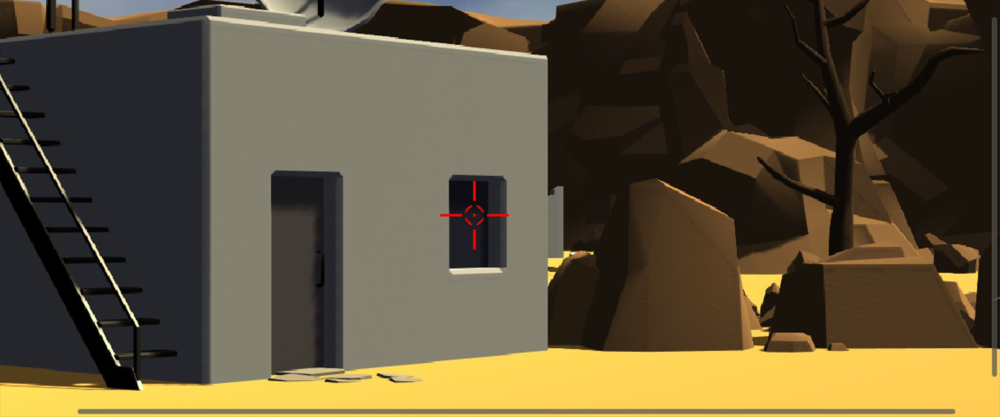
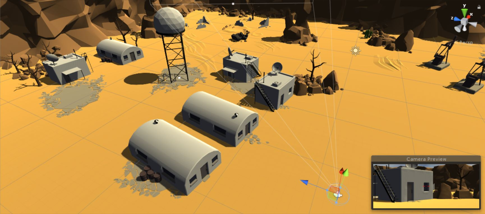

# DesertShooterVR
Sample first-person-style shooter game for virtual and mixed reality. The goal is to demonstrate how to create a Virtual Reality-style experience using the [Microsoft HoloLens](http://hololens.com). This is inspired by the kind of semi-immersive reality found in other projects like the [HoloTour](https://www.microsoft.com/en-us/store/p/holotour/9nblggh5pj87).

HoloLens-based "VR" also has the advantage of allowing room-scale movement without any separate tracking equipment. The military base in this sample is actually quite huge and it would otherwise be very hard (i.e. impossible) to track the user accurately as they walk around the base if you had to install external tracks (e.g. HTC Vive) and if the user was tethered to a PC. You'll need a "convention center"-size space to truly walk all over the map, but most of the action is meant to be played from the center of the map.

This is a work in a progress that I am sharing publicly as I add features. 

* **Unity version: 5.6.2f1 Release**
* **HoloToolkit version: 1.5.7**

## Acknowledgements
* This project uses assets from the [Tanks! tutorial](https://www.assetstore.unity3d.com/en/?_ga=1.83361502.975056403.1471960723#!/content/46209/) from the Unite 2015 Training Event. Since the military base uses mobile-grade 3D models, they work well on a self-contained mobile device like the HoloLens.
* Simple Cloud System by [Rispat Momit](https://www.assetstore.unity3d.com/en/#!/search/page=1/sortby=popularity/query=publisher:2616). This cloud system is available for free from the [Asset Store (get it here)](https://www.assetstore.unity3d.com/en/#!/content/6715). If you want to use this cloud system in your own projects, please get it in the [Asset Store](https://www.assetstore.unity3d.com/en/#!/content/6715), not from my project.
* Starship Corvette by [Clint Bellanger](http://opengameart.org/users/clint-bellanger). Get it here at [OpenGameArt.org](http://opengameart.org/content/starship-corvette).
* Brain-Robot by [Atmostatic](https://opengameart.org/users/atmostatic). Get it here at [OpenGameArt.org](https://opengameart.org/content/brain-robot).
* Many sounds from various artists at [OpenGameArt.org](http://opengameart.org/). 

## Features Implemented To Date
* Starter scene that consists of a simple military base in a desert.
* Walk around (physically) when you wear the HoloLens. You can use the arrow keys and mouse look in the Unity editor to debug.
* A starship lands on the helipad in front of you when the game starts. Enemy robots spawn from that spot every few seconds and they will home-in on your location... and track you.
* Air Tap to fire a bullet (or use the HoloLens clicker) to destroy the robots. The crosshair shows where you aim, through the crosshair is deliberately rendered close to you to force you to shift your gaze focus between the crosshair and objects in the distance, kinda like a real gun.
* Simple cloud system (see acknowledgements above).
* Spatial sounds distributed across the scene to provide a better feeling of immersion (e.g. wind sounds in the tower and canyons, machine sound in the factory, pressure sounds in the pump hacks, etc.)

## Implementation Notes
* The shooting system was previously based on projectiles using Unity's physics system, which unfortunately doesn't work too well when you fire bullets at 300 m/s. High performance physics are failing and some collisions simply don't occur, or they get triggered too late. I decided to use the classic "cheat" used in many standard first-person shooters and raycast the impact of my bullets and forego the actual "physics" drop. The game now uses this raycasting system and I will tweak it over time. For example, the current implementation doesn't render any bullet trajectory nor is there any delay between shooting and hitting the target (i.e. there is no bullet travel time).
* This project uses a Skybox, unlike other HoloLens project that usually rely on a black uniform background which would provide transparency on HoloLens. The Skybox preserves the relative feeling of immersion.
* Nothing really happens yet when the enemies catch-up to you, they will just hover around your position and there is no current "Game Over" event in the game.
* The height of the user is currently locked at 1.7m to simulate the eye-level of an adult who is 6ft tall. I will eventually detect the height of the HoloLens vs the floor for a more accurate experience.

## Follow Me
* Twitter: [@ActiveNick](http://twitter.com/ActiveNick)
* Blog: [AgeofMobility.com](http://AgeofMobility.com)
* SlideShare: [http://www.slideshare.net/ActiveNick](http://www.slideshare.net/ActiveNick)
